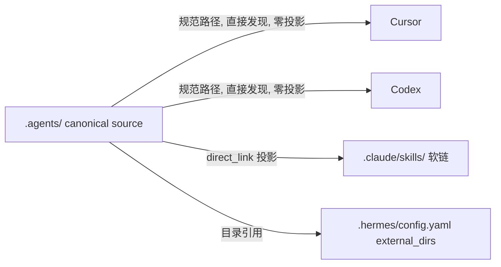

# 收尾 agents-manager 改名 + 资产根迁移到 `.agents/`

## 最终命名约定

三层名字必须分清，这是后续所有改动的基准：

- **产品 / 仓库 / crate**：`agents-manager`（remote 改为 `https://github.com/izhaong/agents-manager.git`）
- **资产根**（用户资产，遵循 Agent Skills 规范）：`~/.agents/` 与 `<repo>/.agents/`
- **工具状态**（运行时数据，非资产）：`~/.config/agents-manager/secrets.env`、`Application Support/agents-manager/store.sqlite`、`<deploy_base>/.agents-manager/projection-ledger.sqlite`、marker `.agents-manager-deploy.json`、`.agents-manager-migrations`、`.agents-manager-projection.lock`、`.agents-manager-import.lock`

注意 `.agents-manager` 在**字符串**层面以 `.agents` 开头。Rust 的 `Path::starts_with` 按路径分量比较，逻辑上安全；但批量正则替换极易误伤，所有批改必须用带边界的精确模式（例如只匹配 `.agents-manager/` 或 `"\.agents/"`），不能用裸 `.agents`。

## 阶段 0：收尾改名并修复构建

上一轮全局替换只命中了连字符形式，仓库现在处于半完成状态，**workspace 解析不了、构建是坏的**。

- **目录未改名**：`Cargo.toml` 的 members 指向 `crates/agents-manager-core` 等，磁盘上却是 `crates/agents-manager-*`。用 `git mv` 把 6 个 crate 目录与 `apps/agents-manager-gui` 改成 `agents-manager-*`。
- **补齐另外三种形式**（约 90 处）：
  - `agents_manager_gui_lib` → `agents_manager_gui_lib`（[apps 的 Cargo.toml](apps/agents-manager-gui/Cargo.toml) 第 11 行 + 两个 `main.rs` 调用点）
  - `PlatformId::AgentsManager` → `AgentsManager`。该枚举带 `#[serde(rename_all = "lowercase")]`，序列化值会从 `"agentsmanager"` 变成 `"agentsmanager"`，必须同步改 [platform.rs](crates/agents-manager-core/src/platform.rs) 的 `platform_label`、`parse_platform_str` 别名表，以及 GUI 的 `Platform` 联合类型（[types.ts](apps/agents-manager-gui/src/types.ts) 第 3 行）、`platformIcons.ts`、`styles.css` 的 `.agentsmanager-btn`、i18n key。顺手在 `parse_platform_str` 加 `"agents"` 别名，与资产根同名更好记。
  - 环境变量 `AGENT_MANAGER_ROOT`/`_SECRETS_DIR`/`_SEED`/`_TTS`/`_HOME`/`_TEST_ENV_LOCK`/`_REL` → `AGENTS_MANAGER_*`（69 处）。这是用户可见的破坏性变更，需在 CHANGELOG 注明。
- **远程地址**：`git remote set-url origin https://github.com/izhaong/agents-manager.git`。GitHub 上的 `izhaong/agents-manager` 需要你先重命名或新建，否则 push 会失败。
- **断链修复**：根 `AGENTS.md` 与 `templates/project/AGENTS.md` 两个软链仍指向已不存在的 `.agents-manager/prompts/AGENTS.md`。
- **git 未记录 rename**：`.agents-manager/` → `.agents/` 是用普通 `mv` 做的，git 记成「删除 + 未跟踪」。需要 `git add -A` 让它落成 rename，保住文件历史。

本机没有 Rust 与 Node 工具链（`cargo`、`npm` 均不可用），阶段 0 完成后只能做静态核对；真正的 `cargo test` 与 `npm run build` 需要在有工具链的环境或 CI 上验证。

## 阶段 1 及之后：资产根迁移到 `.agents/`

改动本身只是一个常量，但它让 **canonical source 与 Cursor/Codex 的投影目标变成同一个物理路径**，这是本次工作的真正难点。

- 现状：Cursor/Codex 投影目标 = `~/.agents/skills/<name>`（[platform_adapter.rs](crates/agents-manager-core/src/projection/platform_adapter.rs) 第 150 行 `context.deploy_base.join(".agents/skills")`）。
- 改后：源也是 `~/.agents/skills/<name>`，两者重合。
- 机器现状：`~/.agents/` 已存在且是你的真实资产树（git 仓库 `.ai-config.git`，60+ skills、`rules/`、`agents/`、`commands/`、`hooks/`、`hooks.json`、`mcp.json`）。**无需搬迁数据**。
- 已有病征：`~/.agents/.agents/skills/` 是把 `~/.agents` 当项目根重复投影产生的嵌套副本，需要清理并从机制上阻止。

Spec 008 早已把 `.agents/skills` 定为 Cursor/Codex 共享 target（[spec.md](specs/008-source-first-projection/spec.md) 第 168-173 行、FR-009），但**没有预见 source == target**，所以现有 planner 没有自投影守卫。

### 数据流（改动后）



## 1. 核心常量

[paths.rs](crates/agents-manager-core/src/paths.rs) 目前被上一轮替换改成了 `.agents-manager`，需要纠正为资产根：

```rust
pub const USER_ASSET_DIR_NAME: &str = ".agents";
pub const BUNDLE_SEED_DIR_NAMES: &[&str] = &[".agents", "seed"];
```

`ASSET_SUBDIRS`（`skills`/`rules`/`agents`/`commands`/`hooks`）保持不变，加上 `mcp/servers/` 与 `prompts/AGENTS.md`，正好与 `~/.agents/` 现有布局吻合。`resolve_project_roots` 和 `project_asset_root` 都由该常量派生，自动跟随。`is_agents_manager_repo`（探测 `crates/agents-manager-core/`）随目录改名同步。

## 2. 自投影守卫（本次最关键）

### planner
[planner.rs](crates/agents-manager-core/src/projection/planner.rs) 的 `plan_direct_link`（第 1958 行起）在算出 `source_path`（1966 行）之后、进入 `classify_projection` 之前短路：

- 若 `source_path == intent.target.path`（两侧都已 canonicalize），对 Sync / Retract / Uninstall 一律返回 `ProjectionActionKind::Noop`，新 `reason_code` 用 `source_is_canonical_target`，并且**不写 ledger ownership**。
- 这样就绕开了当前的 `ProjectionState::Equivalent -> AdoptEquivalent`（2002-2006 行）。`AdoptEquivalent` 会 `rename(target → backup)` 再建软链，落在源上等于搬走用户资产。

复用 `Noop` 而不新增 enum 变体，避免动 `ProjectionActionKind` 的序列化契约。守卫放在 `plan_direct_link` 而非 adapter，因为 adapter 被设计成纯目标描述、拿不到源根。

### executor
[executor.rs](crates/agents-manager-core/src/projection/executor.rs) 加一道纵深防御：`AdoptEquivalent`、`RemoveManagedCopy`、`RemoveManagedLink`、`CopyFallback` 在执行前若发现 action 的 source 与 target 同路径，直接返回 `CoreError` 拒绝。现有 `ensure_target_is_allowed`（3496 行）只校验 target 在 `deploy_base` 内，不排除源子树。

## 3. 迁移盘点去重

[migration.rs](crates/agents-manager-core/src/projection/migration.rs) 的 `inventory()`（273-320 行）会分别扫 canonical layer 的 `asset_root/skills` 和 `deploy_base/.agents/skills`。改动后两者同路径，同一个 skill 会被记两条（provenance `Canonical` 与 `PlatformCurrent`）。需要在 platform 扫描前跳过等于任一 canonical layer 的路径。

## 4. 现有 `~/.agents/` 的适配

- **清理嵌套副本**：`~/.agents/.agents/skills/` 是投影产物，确认无独有内容后删除；守卫上线后不会再生成。
- **MCP 布局**：`~/.agents/mcp.json` 是单体旧布局，而 source-first 的 canonical 是 `mcp/servers/<name>.json`（[projection/source.rs](crates/agents-manager-core/src/projection/source.rs) 第 64 行）。需要把 `mcp.json` 拆成 `mcp/servers/<name>.json`。注意 `mcp_json.rs::migrate_legacy_mcp_layout` 方向相反（servers 合并进 mcp.json）且**当前无调用方**，不要误用。
- **异物容错**：`~/.agents/skills/` 下有 `cache/`、`logs/`、`scenarios/`、`skills/` 四个无 `SKILL.md` 的目录，以及 `README.md`、`.secret.key`、`.skills-manager.lock`、`skills-lock.json`、`scripts/`（属另一个 skills-manager 工具）。确认 scanner 跳过而非报错。
- **旧根兜底**：`~/.ai-config/` 仍残留一个近空的 `skills/`。加一条只读检测，发现 `~/.ai-config/` 或 `~/.agents-manager/` 时提示用户，不做自动搬迁（你的资产已在新位置，自动搬迁反而有风险）。

## 5. 本仓 dogfood 与模板

- `.agents/` 已在工作区就位，需让 git 记成 rename（见阶段 0）。
- 修复根 `AGENTS.md` 与 `templates/project/AGENTS.md` 软链，指向 `.agents/prompts/AGENTS.md`。
- `templates/project/.agents-manager/` → `templates/project/.agents/`（尚未改）。
- [.gitignore](.gitignore)：资产相关条目改 `.agents/`；`daemon.sock`/`daemon.pid`/`*.db`/`secrets.env` 这些工具状态条目改为 `.agents-manager/`。
- [repository_hygiene.rs](crates/agents-manager-cli/tests/repository_hygiene.rs) 里的 `prompts/AGENTS.md` 断言、符号链接断言、`mcp.json` 禁令全部改为 `.agents/`。
- 新增断言：`.agents/` 下不得出现嵌套 `.agents/`。

## 6. GUI / CLI / 文档

- [CopyToProjectModal.tsx](apps/agents-manager-gui/src/components/feedback/CopyToProjectModal.tsx) 的 `${root_path}/.agents-manager` 改 `.agents`；两份 i18n locale 里提到资产路径的文案同步。
- GUI 平台状态：Cursor/Codex 的 skills 现在「源即目标」，不该再显示为未链接。需要在 `aggregatePlatformState` / `PlatformIconButtons` 增加一个「规范路径，已可直接发现」的状态呈现。
- 文档：[platform-contracts.md](docs/reference/platform-contracts.md) 第 7 行的 canonical source 描述、第 22 行 Skills 契约表补充「source 与 target 同路径时为 no-op」；[spec.md](specs/008-source-first-projection/spec.md) FR-001 的资产根写法；README、AGENTS.md、CLAUDE.md、PRD、ARCHITECTURE 的路径引用。
- CHANGELOG 记录三项破坏性变更：crate/二进制改名、环境变量改名、资产根从 `~/.ai-config` 体系改为 `~/.agents/`。

## 7. 测试

- 批量替换测试 fixture 路径时，**资产根**用 `.agents/`，**工具状态**字面量保留 `.agents-manager` 前缀：`.agents-manager/projection-ledger.sqlite`、`.agents-manager-deploy.json`、`.agents-manager-migrations`、`.agents-manager-projection.lock`、`.agents-manager-import.lock`、`.config/agents-manager`。必须用带边界的精确模式，不能用裸 `.agents`。
- 新增用例：
  - source == target 时 Sync 产出 `Noop`/`source_is_canonical_target`，且 ledger 无写入。
  - source == target 时 Retract 不删除源目录。
  - executor 在同路径下拒绝 `AdoptEquivalent`。
  - `inventory()` 对同路径不产生重复条目。
  - Claude 投影与 Hermes `external_dirs` 在新根下仍正常。

## 待你确认的两点

- `~/.agents/agents/` 用于存放 subagent，读起来有点绕（`.agents` 里再套 `agents`）。规范只约定了 `skills/`，其余目录名由我们定。保持现状还是换个名字（例如 `subagents/`）？
- `~/.agents/mcp-secrets.env` 含真实 API key，而那个仓库的 `.gitignore` 只忽略了 `secrets.env`、没有忽略 `mcp-secrets.env`，可能已被提交。这是你另一个仓库的问题，但值得顺手处理。
