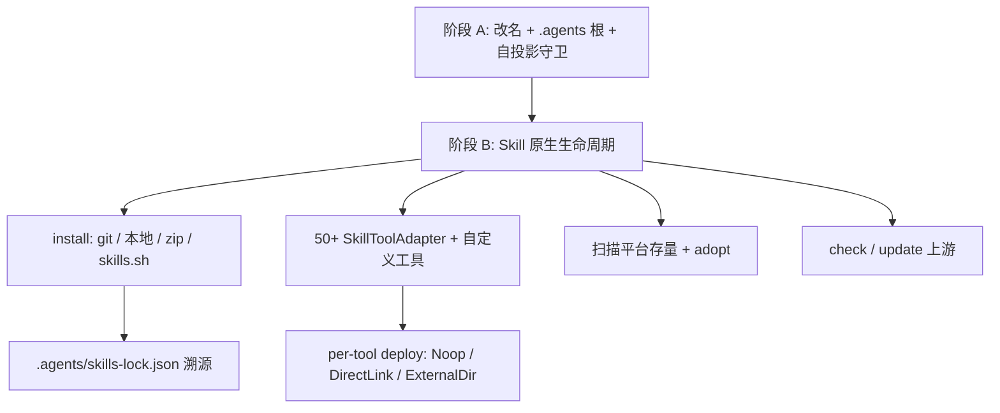

# 资产根迁移 + 按 skills-manager 复刻 Skill 生命周期

参考实现：[xingkongliang/skills-manager](https://github.com/xingkongliang/skills-manager)（Rust core：`installer` / `git_fetcher` / `scanner` / `sync_engine` / `tool_adapters` / `skillssh_api`）。本仓只复刻 **skill 这一层**；rules / mcp / agents / hooks 仍只服务 Cursor / Codex / Claude / Hermes。

不做：preset、GitHub device-flow 备份（资产仓已有 [git.rs](crates/agents-manager-core/src/git.rs)）。

## 两阶段总览



阶段 A 是阶段 B 的前置：Canonical 源与 Cursor/Codex/Cline 等的消费路径会变成同一个 `~/.agents/skills`，没有自投影守卫就不能安全安装/更新。

---

## 阶段 A（原计划，仍要做）

详见既有约定，这里只列必须落地的点：

- 收尾 `agents-manager` 改名（crate 目录、`agents_manager_*`、`AGENTS_MANAGER_*`、`PlatformId::AgentsManager`）。
- [paths.rs](crates/agents-manager-core/src/paths.rs)：`USER_ASSET_DIR_NAME = ".agents"`。
- [planner.rs](crates/agents-manager-core/src/projection/planner.rs) `plan_direct_link`：`source == target` → `Noop` / `source_is_canonical_target`，不写 ledger。
- [executor.rs](crates/agents-manager-core/src/projection/executor.rs)：同路径拒绝破坏性动作（对齐 skills-manager 的 `ensure_dst_not_inside_src`）。
- [migration.rs](crates/agents-manager-core/src/projection/migration.rs) `inventory()` 跳过与 canonical 同路径的 platform 扫描。
- 清理 `~/.agents/.agents/` 嵌套副本；scanner 跳过无 `SKILL.md` 的异物（`cache/`、`logs/`、`skills-manager.db`、`.skills-manager.lock` 等）。

**Codex 路径不跟 skills-manager 走。** 对方把 Codex 投到 `~/.codex/skills`，另把 `~/.agents/skills` 当 discovery fallback。本仓 Spec 008 已把 Cursor/Codex 定为共享 target `.agents/skills`。阶段 B 的目录表里这两个 key 标记为 **SharedCanonical**（Noop），不要再往 `.codex/skills` 复制一份。

---

## 阶段 B：Skill 实现（对标 skills-manager）

### 架构边界

不要把 `PlatformId` 扩成 50 个枚举：rules/mcp/hooks 仍只用 4 个 IDE。Skill 单独一层数据驱动目录：

| 层 | 职责 | 现状 | 目标 |
| --- | --- | --- | --- |
| `PlatformId` | 全资产平台 | 5 个硬编码 | 不变 |
| `SkillToolAdapter` | 仅 skill 的发现/下发路径 | 无 | 从 skills-manager `default_tool_adapters()` 抬表（约 50 个 key） |
| Canonical 库 | 唯一 skill 源 | `.agents/skills/<name>/` | 不变；安装先进库，再按工具下发 |

每个 adapter 字段对齐对方 `ToolAdapter`：`key`、`display_name`、`relative_skills_dir`、`relative_detect_dir`、`additional_scan_dirs`、`override_skills_dir`、`recursive_scan`、`project_relative_skills_dir`、`is_custom`。

下发模式由路径关系推导，不按工具硬编码：

- `skills_dir` canonicalize 后等于 canonical `asset_root/skills` → **SharedCanonical / Noop**（Cursor、Cline、Warp、Copilot 的 `.agents/skills` 扫描等）。
- 否则 → 走现有 `DirectLink`（软链，Windows copy fallback）。
- Hermes 一等公民仍写 `config.yaml` `skills.external_dirs`；目录表里的 `hermes` 复用这条契约，不要再往 `~/.hermes/skills` 复制。

自定义工具：用户配置里存 `CustomToolDef`（key + 绝对/相对 skills_dir），写在工具状态目录（`~/.config/agents-manager/`），不进资产 git。

建议新模块（都在 [agents-manager-core](crates/agents-manager-core)）：

- `skill_tools.rs` — 内置表 + 自定义合并 + `is_installed()` 探测
- `skill_install.rs` — 取代 [skills_add.rs](crates/agents-manager-core/src/skills_add.rs) 的 `npx skills add`
- `skill_git.rs` — 从对方 `git_fetcher.rs` 移植：owner/repo、GitHub tree URL、subpath、shallow clone
- `skill_lock.rs` — 读写 `.agents/skills-lock.json`
- `skill_update.rs` — check / update + `held_back_removals`
- `skillssh.rs` — skills.sh 搜索/解析（无 API key）

投影仍走现有 planner/executor；目录表只负责「这个 tool key 的 target 是哪」。

### 1. 原生安装（替换 npx）

当前 [skills_add.rs](crates/agents-manager-core/src/skills_add.rs) 依赖 Node/`npx skills add`，失败面大，也无法记录 git 溯源。

安装只写入 canonical 库（对方 CLI 默认也是「先进库、不自动 sync」）：

- **本地目录** / **`.zip` / `.skill`**：对方 `installer.rs`（Zip Slip 防护、跳过 `.git` 与 symlink、同内容复用目录、碰撞则 `name-2`）。
- **Git**：`owner/repo`、`owner/repo@skill`、GitHub URL + `/tree/` subpath；clone 到临时目录再 copy 进库。
- **skills.sh**：`vercel-labs/agent-skills@react-best-practices` 这类 ref，走 skills.sh API 解析成 git+subpath。
- 判定 skill：目录含 `SKILL.md` 或 `skill.md`；无 marker 则拒绝。名字用 frontmatter `name`，再 `sanitize_skill_name`。

安装完成后写 lock，**默认不下发**。`--to cursor,claude` 才走 projection。

### 2. 溯源 lock（可提交、不污染 skills 目录）

你机器上已有 [~/.agents/skills-lock.json](file:///Users/zhonghao/.agents/skills-lock.json)（vercel/skills-manager 产物），同时 `skills/` 里还堆了 `skills-manager.db*`、`.skills-manager.lock`——那些是工具状态，不应在资产树。

沿用并扩展现有 lock 形态（已有 `source` / `sourceType` / `skillPath` / `computedHash`）：

```json
{
  "version": 1,
  "skills": {
    "brainstorming": {
      "source": "obra/superpowers",
      "sourceType": "github",
      "skillPath": "skills/brainstorming/SKILL.md",
      "computedHash": "...",
      "gitUrl": "https://github.com/obra/superpowers.git",
      "gitRef": null,
      "subpath": "skills/brainstorming"
    }
  }
}
```

- 文件即源：skill 内容只在 `skills/<name>/`。
- 运行时状态（上次 check 时间、held_back）进 store / `~/.config/agents-manager/`，不进 lock。
- 首次启动：读已有 lock；无 git 字段的条目仍可 check（用 `source` + `sourceType=github` 推断）。
- `.gitignore` 忽略 `skills-manager.db*`、`.skills-manager.lock`、`skills/.secret.key`。

### 3. 扫描平台 + adopt

对齐对方 `scanner.rs`：

- 对每个已安装 tool：扫 `skills_dir` + `additional_scan_dirs`。
- 平铺默认只看直接子目录；`recursive_scan`（Hermes）递归，遇到 skill 目录停止，跳过 `.git` / `node_modules` / `.hub`。
- **无 `SKILL.md` 静默跳过**（现在 [platform_scan.rs](crates/agents-manager-core/src/platform_scan.rs) 已基本如此，扩到目录表即可）。
- 指向 canonical 的软链不算「外部存量」。
- `skill adopt <dir>`：把平台上的未纳管 skill copy 进库并写 lock（`sourceType: local`），已有 [import_skill_from_platform](crates/agents-manager-core/src/platform_scan.rs)。

GUI 的 Global Workspace 语义：某 tool 页列出该目录里真实存在的全部 skill（含库外安装的），状态用现有 `Managed / Unmanaged / Synced`。

### 4. 同步更新

对齐对方 `check_skill_update` / `update_git_skill`：

- `skill check [--all]`：对 git/github/skillssh 条目 fetch，比 hash/commit；结果 `up_to_date` / `update_available` / `local_only`。
- `skill update <name>`：重新 clone 到临时目录，算 diff。新版本会删掉现有路径 → **不写盘**，返回 `held_back_removals`（对方明确：CLI 不能默默删文件，GUI 才能确认）。
- 更新成功后刷新 lock hash；已 deploy 且非 SharedCanonical 的 target 再跑一遍 projection（软链无需复制，copy fallback 才需要）。
- 本轮不做后台 auto-update scheduler；GUI 留「检查更新」按钮即可。

### 5. CLI / GUI

扩展 [AssetCmd](crates/agents-manager-cli/src/main.rs)（现仅 `list/show/reveal`）：

```text
agents-manager skill install <src> [--name] [--to <tool>...]
agents-manager skill remove <name> --yes
agents-manager skill deploy <name> --to <tool>
agents-manager skill undeploy <name> --from <tool>
agents-manager skill status <name>
agents-manager skill check [--all]
agents-manager skill update [--all]
agents-manager skill adopt <path>
agents-manager skill search <query>
agents-manager tools list          # 内置 + 自定义 + 是否 detected
```

GUI：把 `npx skills add` 换成原生 install；marketplace 搜 skills.sh；skill 卡上按 **已检测到的** tool 显示 badge（不要一次铺 50 个图标）；设置页可加自定义工具、覆盖路径。

### 6. Spec 与测试

非平凡改动，按门禁新增 `specs/012-skill-native-lifecycle/`（spec.md + plan.md Todos）。阶段 A 的契约补丁仍写进 Spec 008。

测试重点：

- 安装：本地 / 假 git fixture / zip；不依赖 npx。
- SharedCanonical 工具 deploy 产出 Noop，且不删源。
- 普通工具 DirectLink；source==target 被 executor 拒绝。
- scanner 跳过无 SKILL.md 与 lock/db 文件。
- update 在会删文件时 held_back。
- 自定义工具 override 路径可 deploy。
- 读取现有 `skills-lock.json` 能 check。

---

## 明确不搬的对方实现

- Preset / 批量 preset deploy
- GitHub 登录备份、skill-aware merge、SQLite 当 skill 主存储
- 把 `skills-manager.db` 放进 `skills/` 目录
- Codex 双写 `.codex/skills`（与 Spec 008 冲突）
- 后台自动 apply 更新

## 建议落地顺序

1. 阶段 A 做完并能静态核对（本机若无 cargo 则 CI 测）。
2. 写 Spec 012。
3. 抬 `SkillToolAdapter` 表 + SharedCanonical 接到现有 planner。
4. 原生 install + lock，删掉 npx 路径。
5. check/update + adopt + CLI/GUI。
6. 自定义工具与 skills.sh 搜索。
