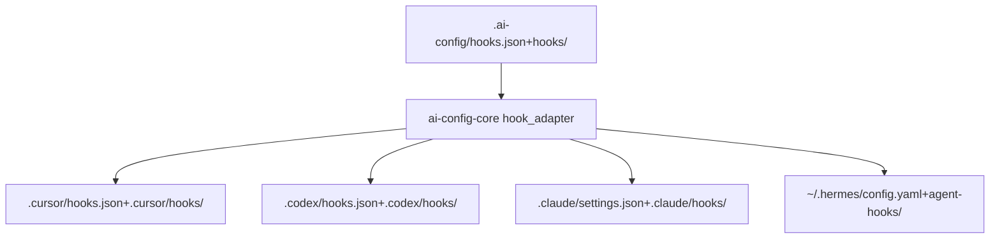

## 背景与目标

你当前仓库已经有：

- 源配置：`.ai-config/hooks.json`（Cursor 风格，扁平 event -> [{command}]）
- 平台生成：`.cursor/hooks.json`（带 `managedBy/hook` + 可选 `matcher`）、`.codex/hooks.json`、`.claude/settings.json`（`hooks` 字段）、Hermes 的 `~/.hermes/config.yaml`
- 核心适配器：`crates/ai-config-core/src/hook_adapter.rs`（已实现 deploy/retract/跨平台拷贝/从平台 import）
- 资产布局规则：`.cursor/rules/hooks-asset-layout.mdc`（强制“单文件 or 目录整包（bundle）”）

这次完善的核心目标：

- **Hook 类型扩展**：支持命令 + prompt + HTTP（对齐 Cursor / Claude / Codex 的能力边界）
- **Bundle 一等公民**：实现目录整包 hook（递归拷贝、入口脚本定位、bundle 元数据）
- **配置语义一致**：在 `.ai-config` 维护 canonical，deploy 时正确映射到 Cursor/Claude/Codex 原生结构，并能 retract/import 不破坏第三方 hooks
- **安全与可控**：把 Cursor 的 `failClosed`、permission/exit-code 语义，以及 Claude 的 `permissionDecision`/`systemMessage` 等输出契约纳入规范；对不支持的能力做显式降级

## 关键差异（我们需要在 adapter 里“对齐/降级”）

- **事件名与结构**
  - Cursor：事件键多为 lowerCamel（`beforeShellExecution`），数组元素直接是 handler（扁平）。
  - Codex/Claude：事件键多为 Pascal（`PreToolUse`、`PostToolUse`），且存在 **matcher group**：`[{ matcher, hooks:[{type, command, ...}] }]`。
- **Hook 类型**
  - Cursor：`command` + `prompt`；云端代理只跑 command。
  - Codex：目前只跑 `type:"command"`（prompt/agent 解析但跳过），且有“信任/审阅”机制。
  - Claude：`command`、`prompt`、`http`、`mcp_tool` 等（更丰富）。
- **阻断语义**
  - Cursor：stdout JSON `permission: allow|deny|ask`；命令 exit code `2` 视为 deny；`failClosed: true` 可失败即阻断。
  - Claude：stdout JSON `hookSpecificOutput.permissionDecision: deny` 等；exit code `2` 的含义与 Cursor 兼容；还支持 `systemMessage` 等。
  - Codex：文档强调并发执行、turn scope 与 trust-review；阻断语义按其事件协议（后续用最小兼容，不尝试复刻 Codex trust 逻辑）。

## 统一的 canonical 源模型（落盘在 `.ai-config`）

在 `.ai-config` 侧引入更通用的 hook manifest（保持向后兼容你现有 `hooks.json`）：

- `hooks.json`
  - `version: 2`（或保持 1，但新增字段允许；以现有解析实现为准）
  - `hooks.<event>[]`：支持两种写法
    - **简写（兼容旧）**：`{ command, matcher? }`（等价于 `type: command` handler）
    - **扩展写法**：`{ type: command|prompt|http|mcp_tool, command?/prompt?/url?, timeout?, failClosed?, matcher?, statusMessage?, ... }`
- Bundle 元数据（形态 B）：`hooks/<bundle>/hook.yaml`（定义入口脚本、默认绑定、平台 enable/disable 等）

> 说明：Codex/Claude 的 matcher-group 结构由 adapter 生成；源侧仍保持 Cursor canonical 的“event -> handler list”，减少认知负担。

## Bundle（目录整包）实现策略

按 `.cursor/rules/hooks-asset-layout.mdc`：

- 形态 A（单文件）：`hooks/<entry>.py`
- 形态 B（bundle）：`hooks/<bundle>/...`，入口脚本由 `hook.yaml` 指定（例如 `scripts/lifecycle-tts.sh`）

adapter 需要支持：

- deploy：当目标是 bundle 时，**递归拷贝整个目录**到平台 hooks 目录下的同名目录；并将平台配置里的 `command` 指向 bundle 内入口脚本。
- retract：能删除平台侧的目录包，并仅移除匹配 token 的配置项。
- import_to_source：从平台导入时，若检测到脚本路径位于某 bundle 目录内，按 bundle 形态导入（至少保证不丢依赖文件）。

## 适配器改造点（`crates/ai-config-core/src/hook_adapter.rs`）

- **数据模型扩展**：从 `HookScriptSpec` / `HookBinding` 扩展为更通用的 `HookHandlerSpec`（含 `type`、`timeout`、`failClosed`、prompt/url 等）。
- **平台能力矩阵**：为每个平台定义支持集与降级策略，例如：
  - Codex：只生成 `type: command` handlers；prompt/http 在 deploy 时给出明确错误或降级为 no-op（推荐：错误，避免“看似生效实际跳过”）。
  - Cursor：支持 command+prompt；云端代理场景提醒“仅命令型可在云端跑”。
  - Claude：支持 command+prompt+http；（可选）支持 `mcp_tool` 透传。
- **事件映射补齐**：基于你现有 `platform_event()`/`canonical_event_key()`，补齐文档中出现但当前可能缺失的事件（如 `PermissionRequest`、`PostToolBatch`、`PostCompact` 等），并明确哪些在 Cursor 侧没有对应事件时如何处理。
- **输出/阻断契约文档化**：在 core 层提供最小“协议说明”（例如在 `docs/` 或 spec 里），并在 hook 生成模板中包含示例。

## 测试与验收

在 `crates/ai-config-core` 添加/更新单测（类似 `hook_adapter.rs` 现有 tests）：

- 单文件 hook：deploy 到 Cursor/Codex/Claude 仍通过，且第三方 hooks 不被覆盖。
- bundle hook：deploy 到 Cursor/Codex/Claude 会复制完整目录，并生成正确 `command` 路径（Cursor 项目路径 vs home 路径、Claude `${CLAUDE_PROJECT_DIR}`、Codex 相对/绝对）。
- 类型分流：
  - Cursor：prompt hook 能写入（并保留 timeout/failClosed）。
  - Codex：遇到 prompt/http 时返回清晰错误。
  - Claude：http hook 写入 settings 的结构正确。

最后按仓库规约跑：`cargo test -p ai-config-core -p ai-config-cli`。

## 影响面（预期会改的文件）

- `crates/ai-config-core/src/hook_adapter.rs`（主要逻辑）
- `crates/ai-config-core/src/hook.rs` 或相关 hook 解析/manifest 代码（增加 handler 类型与 bundle 元数据解析；具体以实际文件为准）
- `.cursor/rules/hooks-asset-layout.mdc`（若需要补充字段约定/示例；尽量不改规则，只补文档示例）
- 新增：`specs/<feature>/spec.md` + `specs/<feature>/plan.md`（按仓库 Spec Kit 流程；实现阶段再落盘）

## 数据流示意

